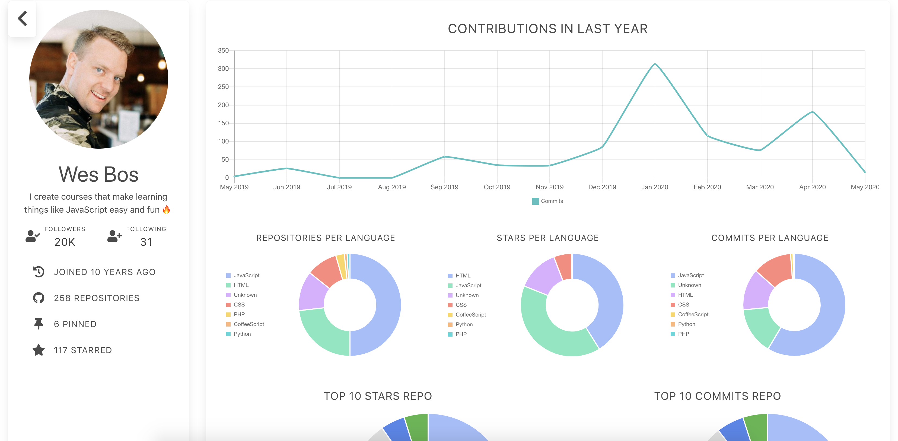

# Github Reporter

   

> Friendly and accessible summary profile for github user

### How to star ?

- Enter to [Github Reporter](https://github-reporter.now.sh/)
- Enter a github username like me `damimd10` and hit enter

That's it, simple.

### Features

- [Apollo Client](https://www.apollographql.com/)
- Animations with [React Reveal](https://www.react-reveal.com/)
- [Bulma](https://bulma.io/)
- Responsive
- Continuos Integration with [CircleCI](https://circleci.com/)
- Deploy with [Vercel](https://vercel.com/)
- E2E Test with [Cypress](https://www.cypress.io/)
- Developer tools - eslint - prettier - husky

### Run Locally

- Clone this repo and install dependencies.
- Create a personal access token on github [here](https://help.github.com/en/github/authenticating-to-github/creating-a-personal-access-token-for-the-command-line).
- Create an `.env` file and add `REACT_APP_GITHUB_TOKEN` variable with your own token.

## Contributing

This tool is to provide a better visualization way to developers and recruiters about the contributions of a user on github, as well as see their orientation and where they stand out. Any suggestion, or additional feature, will be welcome.
